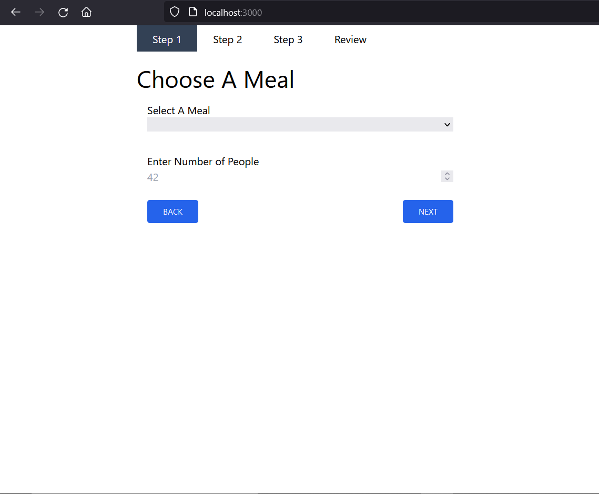
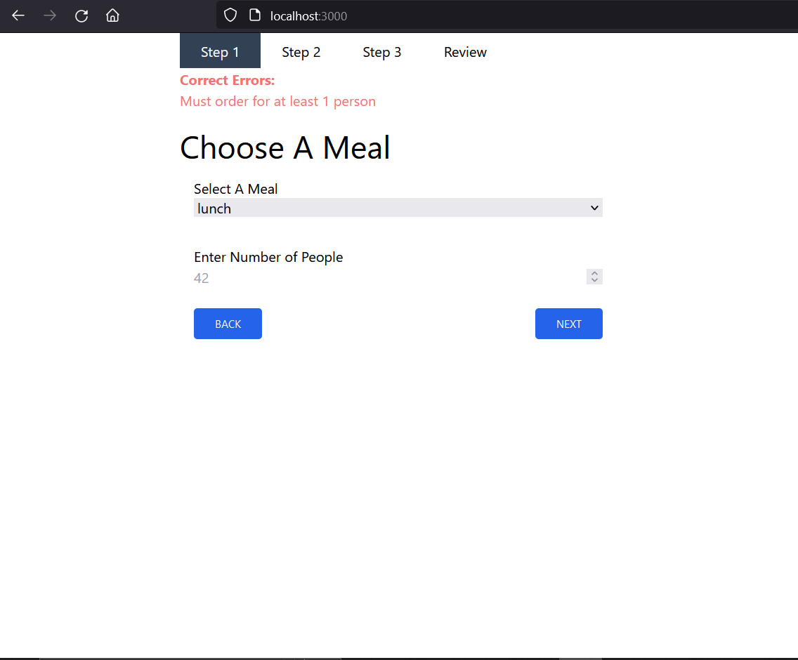
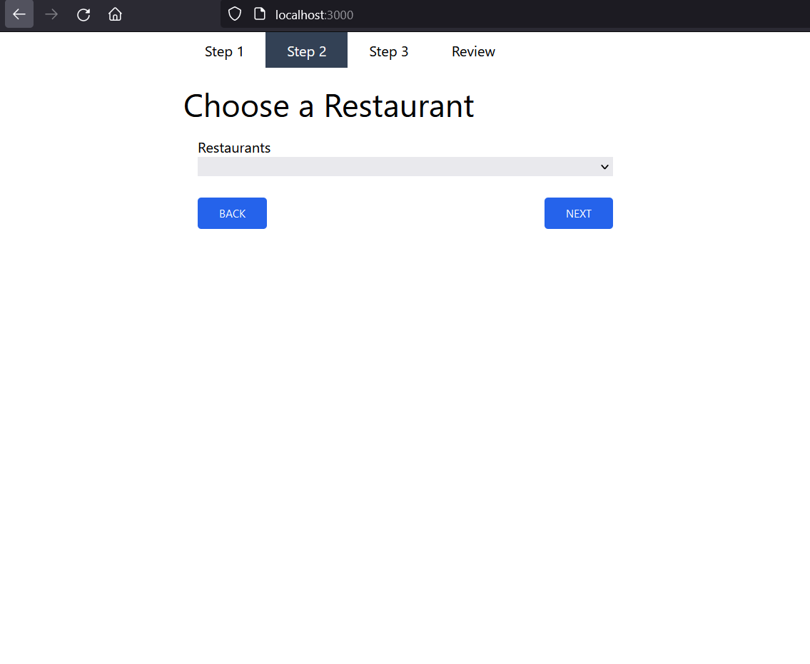
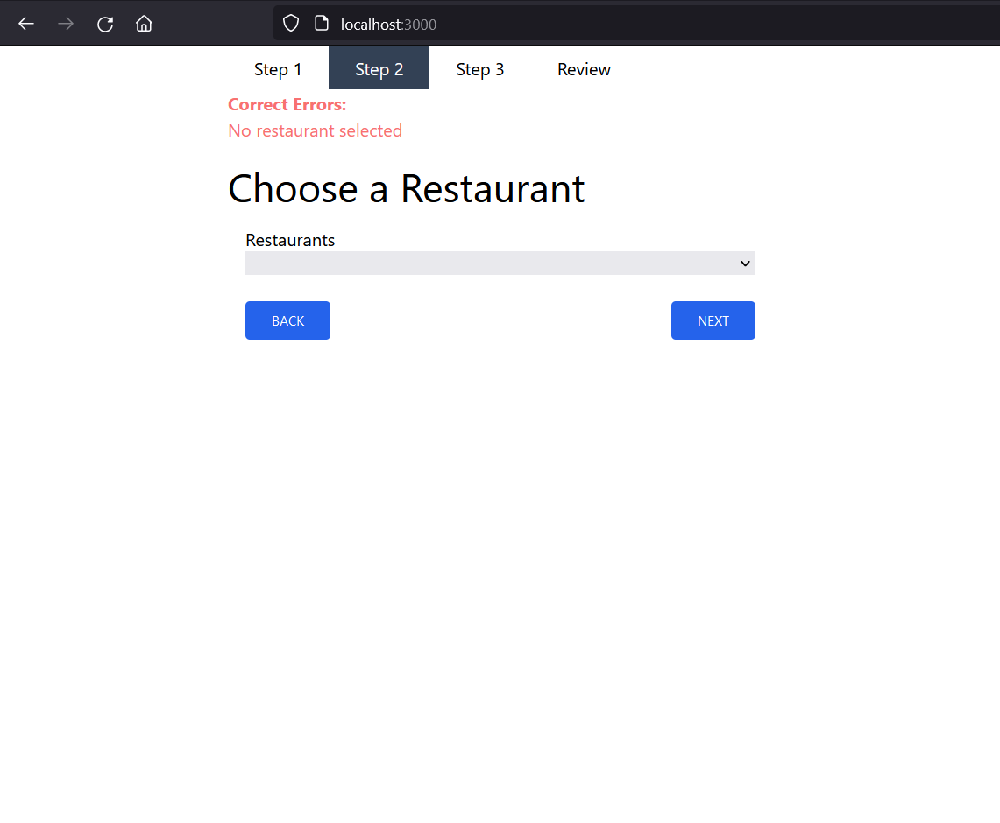
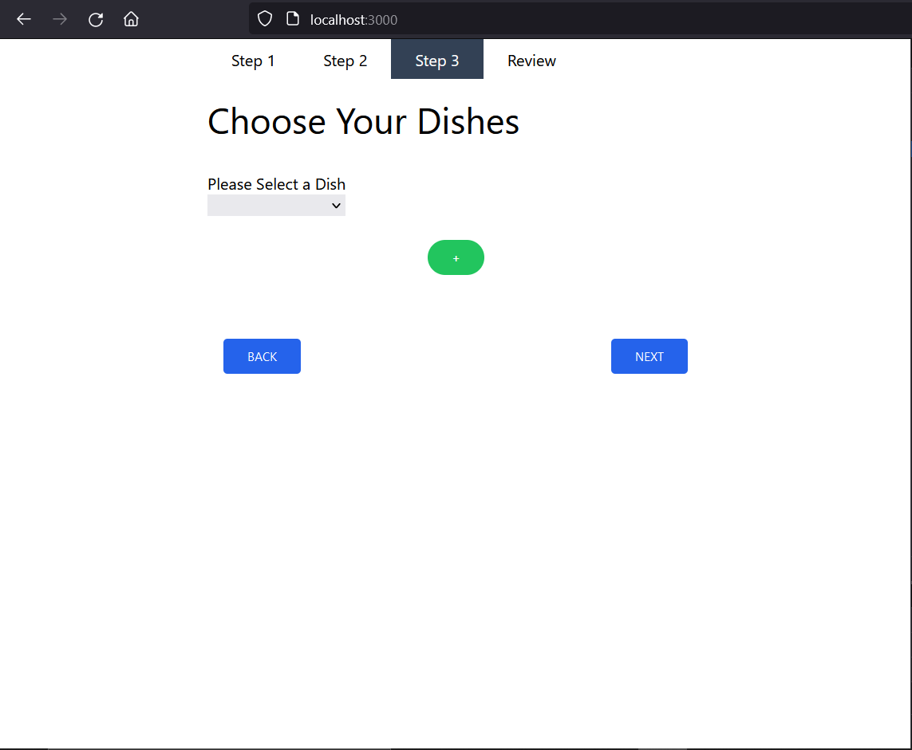
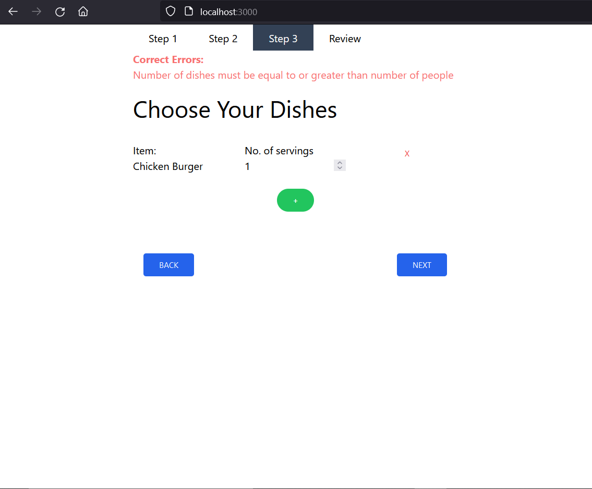
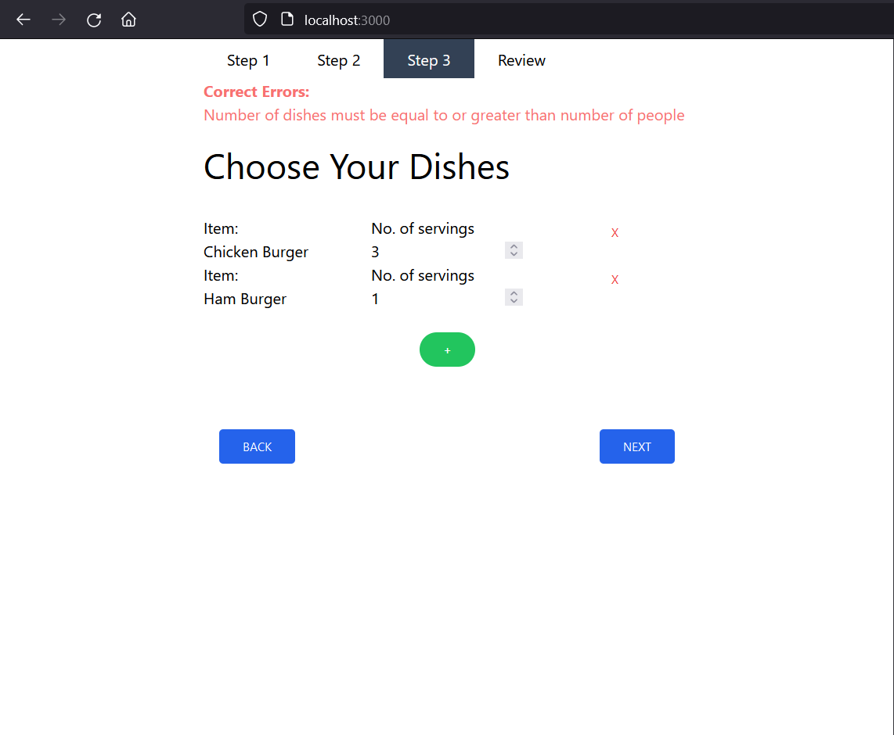
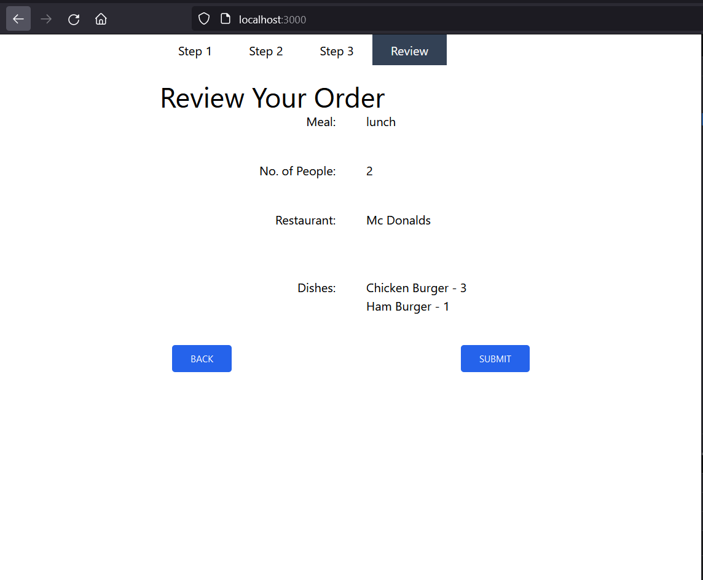
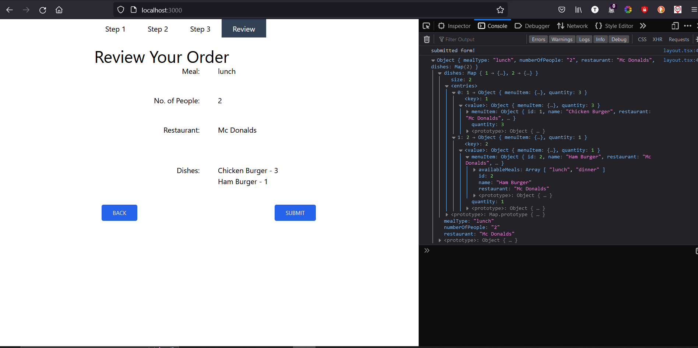
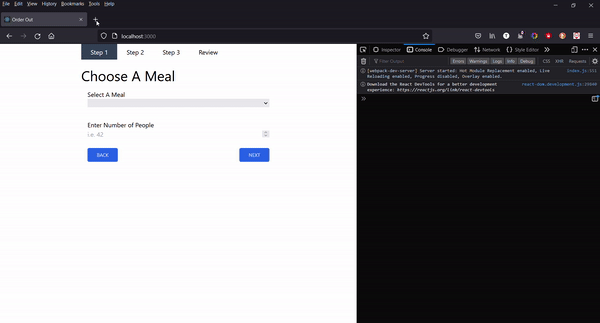

# Order-Out

### Example

The following are screenshots taken from the running application. A video demonstration is also available in `./resources/full-example.mp4`

The following is the landing page of the form

Errors appear if incorrect data is provided (42 is placeholder)

Submitting the correct data takes you to step 2

Again, incorrect data presents an error

Submitting valid data takes you to step 3

Not selecting enough dishes shows an error

We can select multiple items on this step

When we're ready we can go to the review page

When we hit submit, we log the payload to the console

Full Example Below:

### Local Setup

The follow boostrapped documentation is valid for this example applicaiton.

This project was bootstrapped with [Create React App](https://github.com/facebook/create-react-app).

## Available Scripts

In the project directory, you can run:

### `npm start`

Runs the app in the development mode.\
Open [http://localhost:3000](http://localhost:3000) to view it in the browser.

The page will reload if you make edits.\
You will also see any lint errors in the console.

### `npm test`

Launches the test runner in the interactive watch mode.\
See the section about [running tests](https://facebook.github.io/create-react-app/docs/running-tests) for more information.

### `npm run build`

Builds the app for production to the `build` folder.\
It correctly bundles React in production mode and optimizes the build for the best performance.

The build is minified and the filenames include the hashes.\
Your app is ready to be deployed!

See the section about [deployment](https://facebook.github.io/create-react-app/docs/deployment) for more information.
